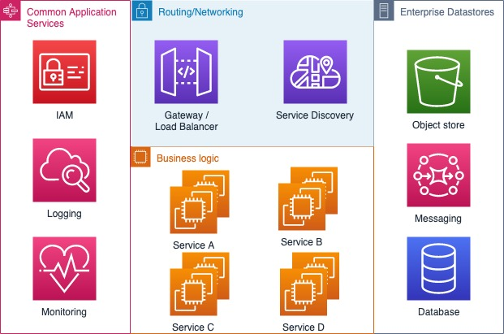

# Assignment

The goal of this assignment is to build a simple first version of a **Lease-a-leaseCar API**. The **Lease-a-leaseCar API** should be built according the microservices principles.

#### What is a **microservice**?

Microservices are small, autonomous services that work together. Let’s break that definition down a bit and consider the characteristics that make microservices different.

Below you see a generic architecture how you can built and assemble a microservice application.

#### Lease-a-leaseCar API

The **Lease-a-leaseCar API** is REST API which allows to maintain vehicle versions, customers and other data needed to service a broker.

The end-users of the **Lease-a-leaseCar API** are:

- Brokers which calculate the leaserate for a customer, and maintain customer data.
- Leasing company which maintains data to make a accurate calculation.

## Functional Requirements

The **Lease-a-leaseCar API** has the following _functional requirements_:

- You can maintain (add, change and delete) a customer. (Name, street, housenumber, zipcode, place, email, phonenumber)
- You can maintain basic cardata attributes
    - Make
    - Model
    - Version
    - Number of Doors
    - CO2-emission
    - Gross price
    - Nett price
- The leaserate is depending on the following parameters:
    - Mileage, the amount of kilometers on annual base
    - Duration of the contract in months
    - Interest rate w/ startdate
    - Nett price
- Leaserate = ((( mileage / 12 ) * duration ) / Nett price) + ((( Interest rate / 100 ) * Nett price) / 12 )
- Example calculation:
    - Mileage: 45000 km/yr
    - Duration: 60 mnths
    - Interest rate: 4.5%
    - Nett Price: € 63000
    - **Leaserate: € 239,76 per mnth**
- The broker and employees who keep track of the data must log into the API before any subsequent call can be made.
- The identity should be validated every call.

## Non-functional Requirements

- The **Lease-a-leaseCar API** is built using Java 8+ w/ Springboot 2.1.x
- Maintainability is favoured over performance. No complex performance optimizations should be needed.
  Another developer should be able to continue where you left off.
- It should contain service-2-service communication
- Add token-based security (oauth/jwt)
- A in-memory datastore can be used this first version.
- Document your code (javadoc)
- Write unit tests for your code.
- Use Google Java Style Guide [link](https://google.github.io/styleguide/javaguide.html)

## Bonus objectives

The following are not required, but can be seen as nice-to-have's:

- Use Swagger to document to REST API
- Store the data in a persistent datastore
- Make the service ready for containerization

## Deliverables

This assignment should be delivered in the following way:

- All code is pushed to a git-like (personal) repository (github/gitlab/bitbucket).
- Documentation is provided in the [README.md](README.md) on how the API works, and **how to run it**.
- Any information, (dummy)-data, files, and other assets that are needed to run this API, are provided in this repository.

## Tips and remarks

- Think of what you're building as a real **Product**. Think of your end-users and what they want.
- Choose a suitable data structure for modeling the leaseCar and customer data. 
- Design your API in an intuitive way, design it according to the best practices of the API technology you choose
- Work in an agile way! You might not be able to implement all of the features for this assignment in the alotted time,
  so be smart in picking the features you work on first.